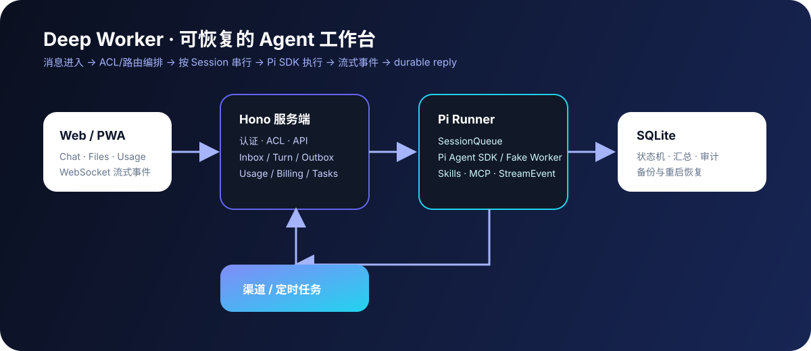

<div align="center">
  
  <h1>Deep Worker</h1>
  <p>基于 Pi RPC 的自托管、多用户 Agent 工作台</p>
  <p>把 Workspace、会话队列、流式执行、工具调用与可靠性状态收敛到一条可观测消息闭环。</p>
</div>

<p align="center">
  
  
  
  
</p>


## 它解决什么问题

Deep Worker 面向需要自托管 Agent 工作台的团队：一个用户可以拥有多个 Workspace，每个 Workspace 维护独立的 Runtime Session；消息进入后经过持久化队列，由 Pi Runner 执行并把流式事件回传到 WebSocket，最终回复和 Outbox 状态都可恢复、可追踪。

它不是只把聊天页面接到模型 API 上，而是把执行边界、会话串行、失败重试、Provider 故障转移、用量账本和权限控制放在服务端统一管理。

## 快速启动

需要 Node.js 20+。

```bash
npm install

# 无需 API Key 的本地演示：使用确定性的 Fake Pi Runner
DEEP_WORKER_RUNNER=fake npm run dev -w server

# 另开终端启动 Web
npm run dev -w web -- --host 127.0.0.1
```

PowerShell 可以这样设置演示模式：

```powershell
$env:DEEP_WORKER_RUNNER = "fake"
npm run dev -w server
```

打开 [http://127.0.0.1:5173/setup](http://127.0.0.1:5173/setup) 创建首个管理员。服务端默认使用真实 Pi Runner；生产环境不设置 `DEEP_WORKER_RUNNER=fake`，并确保 `pi --mode rpc` 可执行且 Provider 凭据已配置。若只启动后端，API 地址为 [http://127.0.0.1:3000](http://127.0.0.1:3000)。

## 核心能力

| 领域       | 能力                                                                         |
| ---------- | ---------------------------------------------------------------------------- |
| 工作台     | 多用户、Workspace、Runtime Session、Agent Profile、文件、终端与记忆          |
| Agent 执行 | Pi RPC 进程、流式事件、bash 最小工具集、会话串行与跨会话并发                 |
| 可靠性     | Inbox → Turn → Outbox 状态机、幂等键、指数退避重试、超时和重启恢复           |
| 模型接入   | Provider 加密凭据、会话粘性、Round Robin / Weighted / Failover 与健康恢复    |
| 自动化     | 定时任务、渠道账号、Workspace 挂载、统一渠道地址与入站去重                   |
| 可观测性   | 队列、Runner、Container、Provider 脱敏监控；Token 用量、成本和 CSV 导出      |
| 安全边界   | ACL 权限矩阵、登录锁定、配置脱敏、数据库迁移备份与 Host / Container 执行模式 |

## 架构与消息闭环



```text
用户消息 → API / WebSocket → Inbox
       → 按 session 串行的 Turn 队列
       → Pi Runner（prompt / bash / 流式事件）
       → StreamEvent → WebSocket
       → Outbox / 最终回复 / 用量账本
```

同一 Session 内的消息严格串行，不同 Session 可以并发；进程重启后，未完成 Turn 会从持久化状态恢复。Fake Runner 只用于开发和自动化测试，真实 Pi 行为以 [PI_RPC_BEHAVIOR.md](pi-runner/PI_RPC_BEHAVIOR.md) 为准。

## 从哪里开始看代码

```text
server/      Hono API、SQLite、队列、Provider、渠道与运维能力
pi-runner/   Pi RPC 客户端、Fake Runner、事件解析与工具边界
shared/      WebSocket、StreamEvent 与跨包协议
web/         React + Vite 工作台
docs/        API、ACL、功能对照、计费与运行规格
```

推荐阅读顺序：`server/src/app.ts` → `server/src/runtime-runner-service.ts` → `pi-runner/src/` → `shared/stream-event.ts` → `web/src/pages/ChatPage.tsx`。

## 验证

```bash
npm run typecheck
npm test -- --run
npm run build
git diff --check
```

## 当前边界

- Pi RPC 当前以 bash 驱动的最小工具集为主；Read / Edit / Glob / Grep 结构化工具仍是增量方向，不宣称与 Claude Code 工具集等价。
- Fake Runner 不需要真实模型凭据；真实 Pi、IM 渠道和 Docker 属于需要外部凭据或运行环境的集成验收项。
- 用量与账单是本地 SQLite 账本，不接入真实支付网关。
- Provider 与渠道配置页提供最小可用闭环，渠道连接本身仍取决于对应适配器和外部凭据。

## 文档

- [API 与 WebSocket](docs/API.md)
- [ACL 权限矩阵](docs/ACL-MATRIX.md)
- [功能对照清单](docs/FEATURE-COMPARISON.md)
- [用量与计费规格](docs/USAGE_BILLING_SPEC.md)
- [容器、Provider 与运维规格](docs/CONTAINER_PROVIDER_OPERATIONS_SPEC.md)
- [Pi RPC 行为清单](pi-runner/PI_RPC_BEHAVIOR.md)
