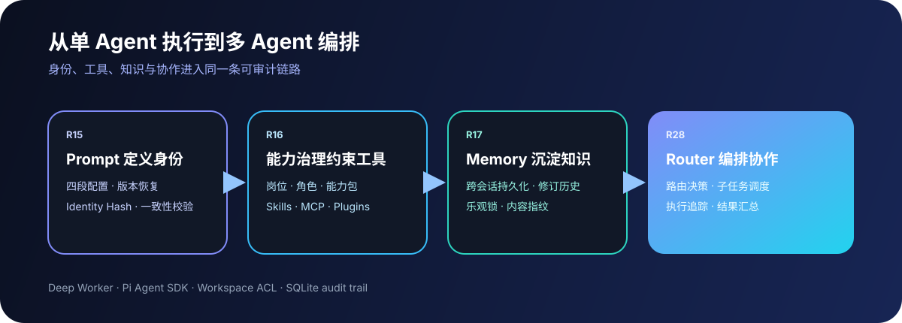
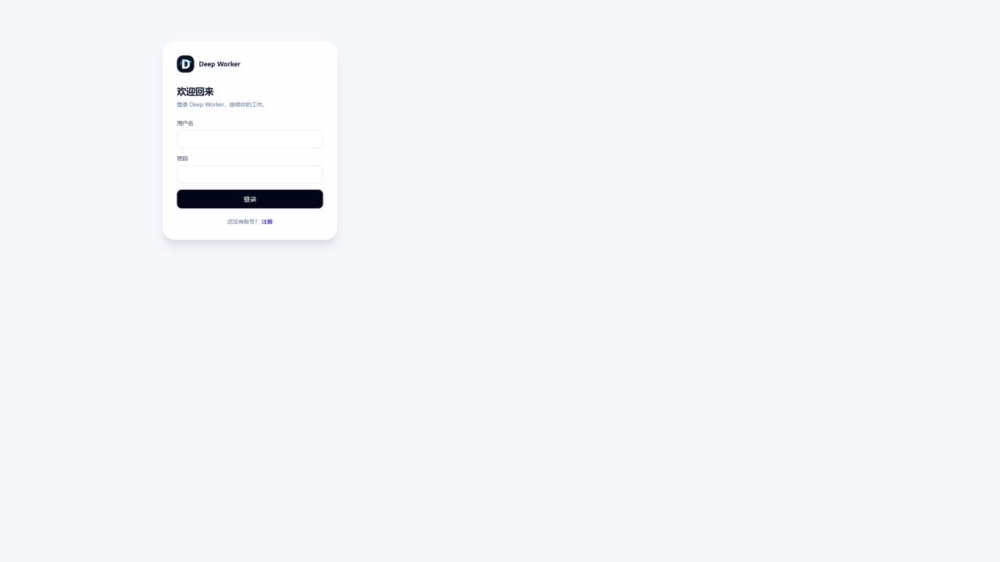

<p align="center">
  
</p>

<h1 align="center">Deep Worker</h1>

<p align="center">
  自托管、多用户、能力感知的多 Agent 编排工作台
</p>

<p align="center">
  Prompt 定义身份 · 能力治理约束工具 · Memory 沉淀知识 · Router 编排协作
</p>

<p align="center">
  
  
  
  
  
  
</p>

<p align="center">
  <a href="#为什么是-deep-worker">产品价值</a> ·
  <a href="#四个核心设计">核心设计</a> ·
  <a href="#能力全景">能力全景</a> ·
  <a href="#快速开始">快速开始</a> ·
  <a href="#安全与可靠性">安全与可靠性</a>
</p>



## 为什么是 Deep Worker

许多 Agent 产品停留在“一个模型加一组工具”的单用户形态：身份难以复用、工具权限缺少边界、历史知识散落在会话中，跨岗位任务只能依赖人工接力。

Deep Worker 将 Agent 运行所需的四类长期资产放进同一个 Workspace：

- **身份可版本化**：结构化 Prompt 形成稳定的 AgentProfile。
- **能力可治理**：岗位、角色、能力包与 Workspace ACL 共同决定工具边界。
- **知识可沉淀**：跨会话 Memory 保存事实、决策、经验与待办。
- **协作可编排**：Agent Router 拆解、调度并追踪跨角色任务。

它不是自由放任的 Agent 群聊，而是一条有权限、有依赖、有审计记录的协作链路。

## 产品界面

| 初始化 Workspace                                | 多用户登录                                      |
| ----------------------------------------------- | ----------------------------------------------- |
|  |  |

Web 工作台还提供会话、AgentProfile、能力包、Memory、Router 计划与执行事件的统一入口。

## 四个核心设计

### R15｜结构化 Prompt 与 Agent 身份

AgentProfile 将配置拆成四个字段：

- **IDENTITY**：身份、职责与稳定人设。
- **SOUL**：行为倾向与协作风格。
- **AGENTS**：Agent 协作约束。
- **TOOLS**：工具使用约束。

Profile 支持长度校验、追加或替换、版本记录和 SHA-256 身份指纹。Router 在规划与执行阶段记录 Profile 版本和哈希，避免身份变化后继续静默执行旧计划。

> 当前运行时主要注入 IDENTITY；完整的四段上下文装配与预算分配仍是后续演进方向。

### R16｜Skills / MCP / Plugins 能力治理

能力不再是用户随意勾选的菜单，而是“岗位—角色—能力包”的确定性治理模型。

| 岗位 | 内置能力包            | 典型边界                                       |
| ---- | --------------------- | ---------------------------------------------- |
| 研发 | code、git、test       | 代码与仓库操作，不直接拥有发布权限             |
| 运维 | deploy、monitor、logs | 监控、日志与发布工具                           |
| 销售 | crm、email            | 客户与邮件工具；知识通过 Workspace Memory 复用 |

系统会解析能力依赖、优先级、allow/deny 规则、MCP 白名单与冲突，并生成稳定的 manifest 和能力哈希。每次路由都同时检查岗位绑定、角色授权和 Workspace ACL；能力变更能够被追踪，而不是悄悄改变执行边界。

研发到发布等跨岗位任务由 Router 串联研发与运维 Agent，无需把所有高权限工具集中到一个“万能 Agent”上。

### R17｜跨会话 Workspace Memory

Memory 将会话结果提升为 Workspace 级资产，支持四类内容：

- `fact`：稳定事实；
- `decision`：已确认决策；
- `experience`：可复用经验；
- `follow_up`：后续事项。

实现包含创建、更新、查询、软删除、版本历史、内容哈希和 `expectedRevision` 乐观并发控制。当前搜索基于 SQLite `LIKE`，强调可审计的结构化记忆，而不是向量 RAG；Memory 也不会未经选择自动注入所有会话。

### R28｜能力感知的 Agent Router

针对单 Agent 无法覆盖跨岗位复杂任务的问题，Router 形成闭环：

```text
任务意图
  → 路由决策（AgentProfile + 岗位能力 + Workspace ACL）
  → 子任务调度（依赖、审批、并发上限）
  → 执行追踪（事件、租约、取消、超时）
  → 结果汇总
```

Router 当前支持：

- 基于规则与关键词识别任务意图；
- 按 Profile、岗位、能力包和 ACL 选择 Agent；
- 持久化 Plan、Task、Event，并记录规划快照与关键哈希；
- 对线性依赖顺序执行，对相互独立的只读任务最多并发 3 个；
- 非只读任务必须审批，只读任务禁止携带 Bash；
- 支持取消、10 分钟执行超时、AbortSignal、SQLite 租约与 fencing token；
- 在 Web 中查看计划、任务、状态和全过程事件。

当前实现不是 LLM 自动规划器，也不承诺任意 DAG、动态重规划或候选 Agent 自动故障转移；它优先保证路由决策可解释、执行边界可控、过程可审计。

## 一个跨岗位任务如何运行

```text
“修复登录故障并发布”

研发 Agent
  code + git + test
  诊断、修改、验证
          │ 依赖完成
          ▼
运维 Agent
  monitor + logs + deploy
  审批、发布、观察
          │
          ▼
Router 汇总结果，Memory 沉淀决策与经验
```

同一 AgentProfile 可以被 Workspace 共享，但不同用户看到和能执行的操作由 ACL 决定：

| Workspace 角色 | AgentProfile     | 对话与执行               | 历史与审计     |
| -------------- | ---------------- | ------------------------ | -------------- |
| 管理员         | 创建、修改、发布 | 可读写                   | 可查看         |
| 普通成员       | 只读             | 可对话；受能力与审批约束 | 可查看         |
| 只读访客       | 只读             | 不可执行                 | 仅查看授权历史 |

## 能力全景

- **多用户 Workspace**：邀请、成员管理、会话共享、审计与角色权限。
- **AgentProfile**：结构化 Prompt、版本、发布、复制与身份指纹。
- **能力治理**：Skills、MCP、Plugins、岗位能力包、依赖和冲突解析。
- **多 Agent 编排**：意图路由、子任务依赖、只读并发、审批、取消与结果汇总。
- **长期记忆**：Workspace Memory、修订历史、冲突检测和软删除。
- **多渠道接入**：Web 工作台与渠道连接器共用会话和权限模型。
- **用量与账务**：套餐、配额、余额与幂等 SQLite 用量账本。
- **可观测性**：结构化日志、路由事件、执行状态和审计记录。

## 架构


```text
React Web / Channel Adapters
            │ HTTP + WebSocket
            ▼
       Hono Server
  Auth · ACL · Profiles · Memory
  Capabilities · Router · Billing
            │ neutral JSON IPC
            ▼
      Pi Agent Runner
    Pi Agent Runtime / SDK
            │
            ▼
   Models · Tools · MCP Servers
```

生产执行链路由服务端启动隔离 Runner，Runner 通过 Pi Agent SDK 创建会话和工具运行时；进程间使用中立 JSON IPC。项目不再依赖 `pi --mode rpc`。

### Monorepo

| Workspace   | 职责                                                  |
| ----------- | ----------------------------------------------------- |
| `server`    | Hono API、认证授权、SQLite、路由、计费与渠道服务      |
| `web`       | React 工作台、会话、Profile、Memory、能力与 Router UI |
| `pi-runner` | Pi Agent SDK 运行时、Worker 生命周期与隔离执行        |
| `shared`    | 跨端类型、Schema 与稳定协议                           |

## 快速开始

### 环境要求

- Node.js 20+
- npm 10+

### 本地运行

```bash
git clone https://github.com/Cordis798/deep-worker.git
cd deep-worker
npm install

# 无模型密钥也可使用可重复的 fake runner
$env:DEEP_WORKER_RUNNER = "fake"
npm run dev -w server

# 另开终端启动 Web
npm run dev -w web -- --host 127.0.0.1
```

打开终端输出中的本地地址，完成 Workspace 初始化并创建第一个管理员。

接入真实模型时，在本地环境变量中配置相应 Provider 凭据，不要把密钥提交到仓库。Runner 会通过 Pi Agent SDK 使用已配置的模型与工具。

### 质量门禁

```bash
npm run typecheck
npm test -- --run
npm run build
git diff --check
```

当前测试基线覆盖 87 个测试文件、256 个测试用例；以本地门禁的实际输出为准。

## 安全与可靠性

- 密码使用 scrypt 派生并带独立盐值；会话 Token 仅保存摘要。
- Workspace ACL、对象级授权和能力 allow/deny 在服务端执行。
- 非只读 Router 任务经过显式审批；只读任务拒绝 Bash。
- 用量扣费与汇总在 SQLite 事务内完成，并以事件 ID 保证幂等。
- 数据库迁移在升级前自动备份，通过 schema version 拒绝降级。
- Runner 支持超时、取消、租约与 fencing，降低重复领取和失联执行风险。
- API Key、Token 和敏感输入不进入普通日志。

## 文档

- [API 说明](./docs/API.md)
- [权限矩阵](./docs/ACL-MATRIX.md)
- [功能对照](./docs/FEATURE-COMPARISON.md)
- [实现状态](./docs/IMPLEMENTATION_STATUS.md)
- [任务记忆设计](./docs/TASK_MEMORY_FILE_SPEC.md)
- [用量与账务设计](./docs/USAGE_BILLING_SPEC.md)

## 当前边界

Deep Worker 聚焦自托管团队协作与可审计编排。当前不包含 LLM 自动生成任意工作流、向量知识库、外部支付网关或跨数据库集群调度。README 中的能力以仓库代码和测试为准。
